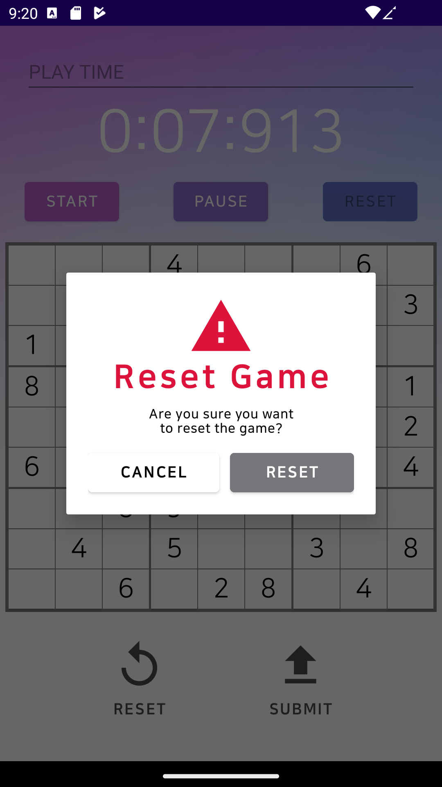
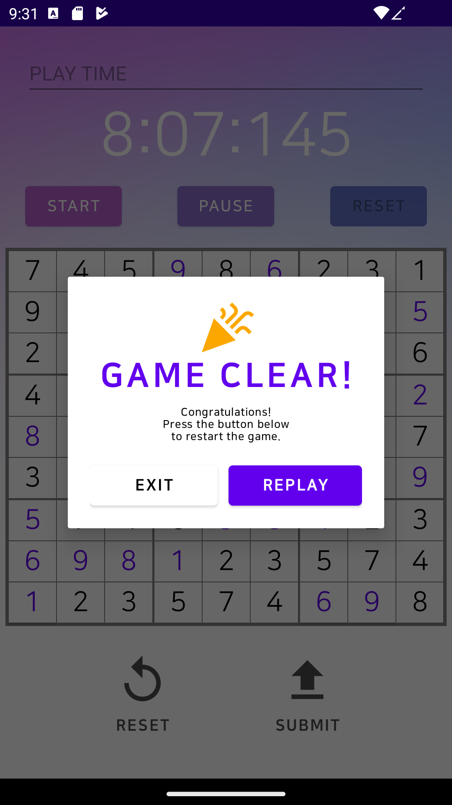

# [2022-2] Mobile Programming
## :video_game: Android Sudoku Project :game_die:
- __프로젝트 기간__ : 2022.10.03 ~ 2022.12.09 (1인 개발)
- __프로젝트 도구__
    
Language : Java, xml
    
IDE : Adroid Studio
- __실행화면__

  

 
